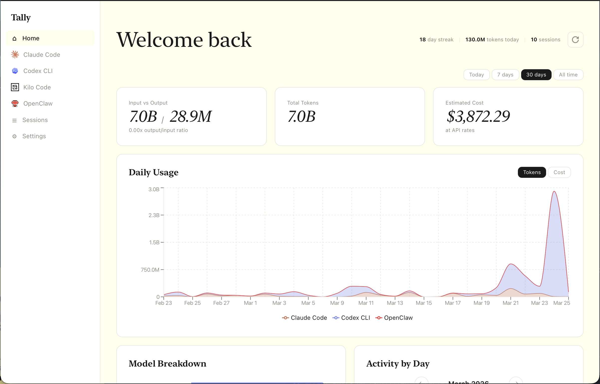
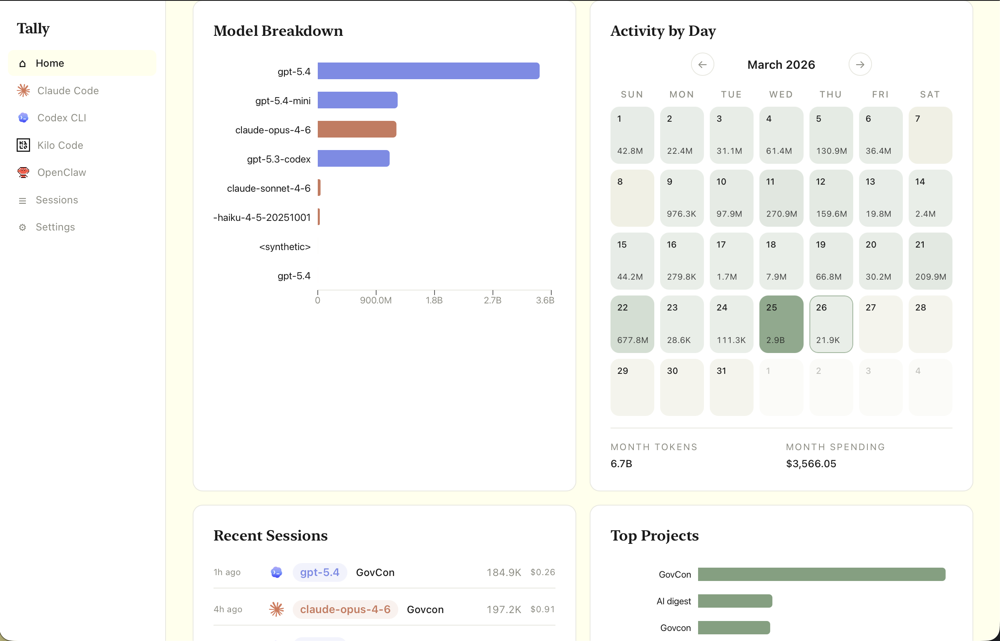

<h1 align="left">
  
  <span>Tally</span>
</h1>

A desktop app for tracking local AI coding usage. Tally reads usage data from supported tools on your machine, normalizes it into a unified SQLite database, and shows dashboards for tokens, spend, sessions, models, projects, and activity patterns.

No cloud, no API keys — everything runs locally.


## Features

- **Unified dashboard** — Combined view across all detected tools
- **Per-tool views** — Filtered dashboards for each tool
- **Session browser** — Paginated session list with filters, expandable to see individual requests
- **Daily usage charts** — Track token and cost trends over time
- **Model breakdown** — See which models you're using and their costs
- **Activity calendar** — Inspect usage patterns by month and day
- **Project breakdown** — See where your usage is going by repo or project
- **Cost tracking** — Customizable per-model cost rates
- **Setup wizard** — Detect installed tools and import data locally
- **Data export** — Export your data as JSON
- **Fully local** — No network calls, no telemetry, read-only access to source data

## Screenshots

### Dashboard Overview


Main dashboard showing token totals, estimated cost, trend lines, and per-tool comparison.

### Activity Calendar


Monthly activity calendar with per-day token intensity, plus model and session breakdowns.

## Supported Tools

| Tool | Data Source |
|------|-------------|
| Claude Code | `~/.claude/` (JSONL session files, stats cache, session index) |
| Codex CLI | `~/.codex/` (SQLite DB + JSONL session files) |
| Cline | VS Code extension local data |
| Kilo Code | VS Code extension local data |
| Roo Code | VS Code extension local data |
| OpenCode | Local app data |
| OpenClaw | Local app data |

## What Tally Is Good At

- Seeing total token usage and estimated spend across tools
- Comparing models, projects, and sessions in one place
- Spotting usage patterns over time
- Importing local data without sending anything to a server

## Prerequisites

- [Node.js](https://nodejs.org/) (v18+)
- [Rust](https://www.rust-lang.org/tools/install) (stable, 2021 edition)
- Tauri v2 system dependencies — see the [Tauri prerequisites guide](https://v2.tauri.app/start/prerequisites/) for your OS

If you installed Rust with `rustup`, make sure `cargo` is on your `PATH` before building Tally.

## Getting Started

```bash
# Clone the repo
git clone https://github.com/goodnight000/tally.git
cd tally

# Install frontend dependencies
npm install

# Run in development mode (starts Vite dev server + Tauri window)
npm run tauri dev
```

On first launch, Tally will detect available data sources and walk you through a setup wizard.

## First Run

1. Launch the app.
2. Let Tally detect supported tools on your machine.
3. Choose which sources to import.
4. Run the initial import.
5. Use the Home dashboard for the combined view or switch to per-tool pages.

## Commands

```bash
# Development (Vite + Tauri window)
npm run tauri dev

# Build production binary
npm run tauri build

# Frontend only (no Tauri window, for UI work at localhost:1420)
npm run dev

# Type-check frontend
npx tsc --noEmit

# Run Rust tests
cd src-tauri && cargo test
```

## Project Structure

```
tally/
├── src/                    # React/TypeScript frontend
│   ├── pages/              # Home, ToolDashboard, Sessions, Settings, Setup
│   ├── components/         # Dashboard widgets, charts, layout, shared UI
│   ├── hooks/              # useDashboard, useSessions, useSync
│   ├── lib/                # Tauri IPC wrappers (tauri.ts) and types (types.ts)
│   └── styles/             # Tailwind v4 theme tokens
├── src-tauri/              # Rust backend
│   └── src/
│       ├── lib.rs          # App entry, command registration, state management
│       ├── commands/       # Tauri commands: sync, dashboard, sessions, settings
│       ├── db/             # SQLite: migrations, queries, models, cost defaults
│       └── parsers/        # Data ingestion from Claude Code, Codex, and others
├── package.json
└── CLAUDE.md
```

## How It Works

1. **Detect** — Scans local data directories for supported tools
2. **Parse** — Reads local JSONL files and SQLite databases from supported tools
3. **Normalize** — Extracts token counts, models, timestamps, and project metadata into `~/.tally/tally.sqlite`
4. **Display** — React frontend queries the unified DB via Tauri IPC and renders the dashboard
5. **Incremental sync** — Tracks watermarks (byte offsets, timestamps) so subsequent syncs only process new data

## Tech Stack

- **Framework**: [Tauri v2](https://v2.tauri.app/) (Rust + Web)
- **Frontend**: React 19, TypeScript, Tailwind CSS v4, Recharts
- **Backend**: Rust, rusqlite (bundled SQLite), serde, chrono
- **Build**: Vite 8, npm

## Privacy

Tally is designed with privacy in mind:

- **No network access** — Zero telemetry, analytics, or cloud services
- **Read-only** — Never writes to supported source data directories
- **Data minimization** — Only stores token counts, model names, timestamps, and project paths. Never stores conversation content.
- **Local storage** — All data lives in `~/.tally/tally.sqlite`

## License

MIT. See `LICENSE`.
